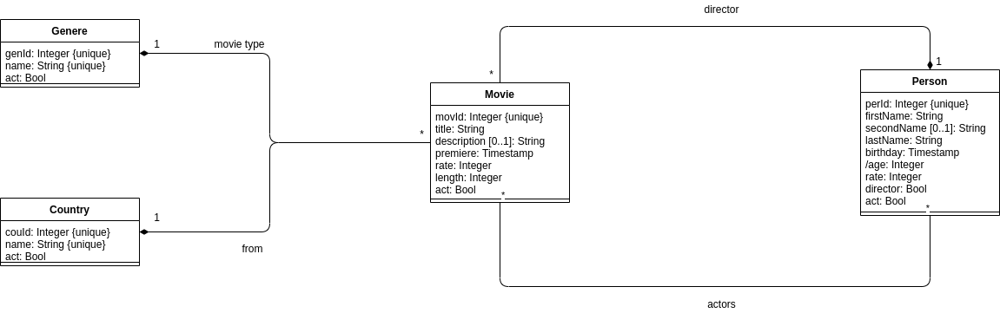

# restbox

**restbox** is designed as simple micro service that exposes REST API for educational purposes. It can be used by future 
software testers to understand REST API basics but also to identify bugs in business logic with tools such as jMeter or 
Postman. Micro service is distributed with in memory SQL relational database, so testing can also research this layer. 
**restbox** exposes really simple REST API connected with movies - business logic is inspired by 
[Filmweb](https://filmweb.pl) (one of the most popular movies catalog in Poland). **restbox** project was created 
exclusively for software testing course blog posts series available on [Para w IT](https://paraw.it).

Exposed by **restbox** REST API operations:
  1. Get movies - returns list of movies including pagination, sorting and filtering.
  2. Get single movie details - returns details about single movie.
  3. Add new movie - add new movie to the catalog based on incoming payload.
  4. Edit existing movie - modifies existing in catalog movie data.
  5. Delete existing movie - deletes all information about movie in catalog.
  6. Get actors - returns list of actors including pagination, sorting and filtering.
  7. Add new actor - add new actor to the catalog based on incoming payload.
  8. Edit existing actor - modifies existing in catalog actor data.
  9. Delete existing actor - deletes all information about actor in catalog.

## Getting started

To start using **restbox**, download the newest version from [GitHub Releases](https://github.com/ternaryss/restbox/releases) section. 
Next step is to extract downloaded archive anywhere on the disk. To run **restbox** on Windows use **restbox.bat**, to run 
it on Unix based system, use **restbox.sh**:

<p align="center">
  
</p>

Described above scripts will allow user to:

1. Run REST API with bugs on port 8080.
2. Run REST API without bugs on port 8081.
3. Clean database (restore initial state).
4. Exit application.

**WARNING**: To run **restbox** installed Java 8 is required.

## Exposed REST API details

**restbox** exposes REST API for given data model:

<p align="center">
  
</p>

Details about each exposed operation can be found in chapters below.

### Get actors

- **Path**: /actors
- **Method**: GET
- **URL parameters**:
  - **firstname**: filter actors over first name
  - **lastname**: filter actors over last name
  - **rate**: filter actors over rating
  - **page**: page of results
  - **size**: size of the page
  - **sort**: sort result set (over output fields, sorting definition: **firstname,asc;lastname,desc**)
- **Status**: 200 or 204

<p align="center">
  
</p>

Output:

```json
{
    "page": 1,
    "pages": 3,
    "size": 5,
    "content": [
        {
            "perId": 2,
            "firstName": "Tim",
            "secondName": null,
            "lastName": "Robbins",
            "birthday": "1958-10-16T00:00+01:00",
            "age": 163,
            "rate": 9,
            "act": true
        },
        {
            "perId": 3,
            "firstName": "Morgan",
            "secondName": null,
            "lastName": "Freeman",
            "birthday": "1937-06-01T00:00+01:00",
            "age": 184,
            "rate": 9,
            "act": true
        },
        {
            "perId": 4,
            "firstName": "Bob",
            "secondName": null,
            "lastName": "Gunton",
            "birthday": "1945-11-15T00:00+01:00",
            "age": 176,
            "rate": 8,
            "act": true
        },
        {
            "perId": 6,
            "firstName": "Francois",
            "secondName": null,
            "lastName": "Cluzet",
            "birthday": "1955-09-21T00:00+01:00",
            "age": 166,
            "rate": 9,
            "act": true
        },
        {
            "perId": 7,
            "firstName": "Omar",
            "secondName": null,
            "lastName": "Sy",
            "birthday": "1978-01-20T00:00+01:00",
            "age": 143,
            "rate": 9,
            "act": true
        }
    ]
}
```

### Add actor

- **Path**: /actors
- **Method**: POST
- **Status**: 201

<p align="center">
  
</p>

Input:

```json
{
    "firstName": "Jan",
    "secondName": "Piotr",
    "lastName": "Kowalski",
    "birthday": "1996-08-04T00:00:00+02:00",
    "rate": 10
}
```

Output:

```json
20
```

### Edit actor

- **Path**: /actors/{perId}
  - **perId**: identifier of actor to edit
- **Method**: PUT
- **Status**: 200

<p align="center">
  
</p>

Input:

```json
{
    "firstName": "Jan",
    "secondName": "Piotr",
    "lastName": "Kowalski",
    "birthday": "1996-08-04T00:00:00+02:00",
    "rate": 10
}
```

Output:

```json
{
    "perId": 2,
    "firstName": "Jan",
    "secondName": "Piotr",
    "lastName": "Kowalski",
    "birthday": "1996-08-04T00:00+02:00",
    "age": 25,
    "rate": 10,
    "act": false
}
```

### Delete actor

- **Path**: /actors/{perId}
  - **perId**: identifier of actor to delete
- **Method**: DELETE
- **Status**: 200

<p align="center">
  
</p>

### Get movies

- **Path**: /movies
- **Method**: GET
- **URL parameters**:
  - **title**: filter movies over title
  - **genere**: filter movies over genere
  - **country**: filter movies over country
  - **rate**: filter movies over rating
  - **page**: page of results
  - **size**: size of the page
  - **sort**: sort result set (over output fields, sorting definition: **title,asc;genere,desc**)
- **Status**: 200 or 204

<p align="center">
  
</p>

Output:

```json
{
    "page": 1,
    "pages": 1,
    "size": 5,
    "content": [
        {
            "movId": 1,
            "title": "The Shawshank Redemption",
            "genere": "Drama",
            "description": "Adaptation of a Stephen King short story. A banker who is wrongly sentenced to life imprisonment, tries to survive in a brutal prison world.",
            "premiere": "1994-09-10T00:00+02:00",
            "rate": 9,
            "length": 144,
            "country": "USA",
            "act": true
        },
        {
            "movId": 2,
            "title": "Intouchables",
            "genere": "Drama",
            "description": "A paralyzed millionaire hires a young suburban boy who has just released from prison to care for him.",
            "premiere": "2011-09-23T00:00+02:00",
            "rate": 9,
            "length": 112,
            "country": "France",
            "act": true
        },
        {
            "movId": 3,
            "title": "The Green Mile",
            "genere": "Drama",
            "description": "A retired prison guard tells a friend about an extraorindary man who was sentenced to death for the murder of two 9-year-old girls.",
            "premiere": "1999-12-06T00:00+01:00",
            "rate": 9,
            "length": 188,
            "country": "USA",
            "act": true
        },
        {
            "movId": 4,
            "title": "The Godfather",
            "genere": "Drama",
            "description": "A story about a New York Mafia family. An aging Don Corleone wants to hand over power to his son.",
            "premiere": "1972-03-15T00:00+01:00",
            "rate": 9,
            "length": 175,
            "country": "USA",
            "act": true
        },
        {
            "movId": 5,
            "title": "12 Angry Men",
            "genere": "Court drama",
            "description": "Twelve jurors are to pronounce sentence in a murder trial. One of them has doubts about the defendant guilt.",
            "premiere": "1957-04-10T00:00+01:00",
            "rate": 9,
            "length": 96,
            "country": "USA",
            "act": true
        }
    ]
}
```

### Get movie

- **Path**: /movies/{movId}
  - **movId**: identifier of movie to get details
- **Method**: GET
- **Status**: 200

<p align="center">
  
</p>

Output:

```json
{
    "movId": 1,
    "title": "The Shawshank Redemption",
    "genere": "Drama",
    "description": "Adaptation of a Stephen King short story. A banker who is wrongly sentenced to life imprisonment, tries to survive in a brutal prison world.",
    "premiere": "1994-09-10T00:00+02:00",
    "rate": 9,
    "length": 144,
    "country": "USA",
    "act": true,
    "director": {
        "perId": 1,
        "firstName": "Frank",
        "secondName": null,
        "lastName": "Darabont",
        "birthday": "1959-01-28T00:00+01:00",
        "age": 62,
        "rate": 9,
        "act": true
    },
    "actors": [
        {
            "perId": 3,
            "firstName": "Morgan",
            "secondName": null,
            "lastName": "Freeman",
            "birthday": "1937-06-01T00:00+01:00",
            "age": 84,
            "rate": 9,
            "act": true
        },
        {
            "perId": 4,
            "firstName": "Bob",
            "secondName": null,
            "lastName": "Gunton",
            "birthday": "1945-11-15T00:00+01:00",
            "age": 76,
            "rate": 8,
            "act": true
        }
    ]
}
```

### Add movie

- **Path**: /movies
- **Method**: POST
- **Status**: 201

<p align="center">
  
</p>

Input:

```json
{
    "title": "A",
    "description": "Test",
    "genere": "Drama",
    "premiere": "2021-11-29T19:30:00+02:00",
    "rate": 5,
    "length": 120,
    "country": "USA",
    "director": {
        "perId": 5
    },
    "actors": [
        {
            "perId": 2
        },
        {
            "perId": 3
        }
    ]
}
```

Output:

```json
20
```

### Edit movie

- **Path**: /movies/{movId}
  - **movId**: identifier of movie to edit
- **Method**: PUT
- **Status**: 200

<p align="center">
  
</p>

Input:

```json
{
    "title": "The Shawshank Redemption 2",
    "genere": "Drama",
    "description": "Adaptation of a Stephen King short story. A banker who is wrongly sentenced to life imprisonment, tries to survive in a brutal prison world.",
    "premiere": "1994-09-10T00:00+02:00",
    "rate": 9,
    "length": 120,
    "country": "USA",
    "director": {
        "perId": 1
    },
    "actors": [
        {
            "perId": 2
        },
        {
            "perId": 3
        },
        {
            "perId": 4
        }
    ]
}
```

Output:

```json
{
    "movId": 1,
    "title": "The Shawshank Redemption 2",
    "genere": "Drama",
    "description": "Adaptation of a Stephen King short story. A banker who is wrongly sentenced to life imprisonment, tries to survive in a brutal prison world.",
    "premiere": "1994-09-10T00:00+02:00",
    "rate": 9,
    "length": 120,
    "country": "USA",
    "act": true,
    "director": {
        "perId": 1,
        "firstName": "Frank",
        "secondName": null,
        "lastName": "Darabont",
        "birthday": "1959-01-28T00:00+01:00",
        "age": 62,
        "rate": 9,
        "act": true
    },
    "actors": [
        {
            "perId": 2,
            "firstName": "Tim",
            "secondName": null,
            "lastName": "Robbins",
            "birthday": "1958-10-16T00:00+01:00",
            "age": 63,
            "rate": 9,
            "act": true
        },
        {
            "perId": 3,
            "firstName": "Morgan",
            "secondName": null,
            "lastName": "Freeman",
            "birthday": "1937-06-01T00:00+01:00",
            "age": 84,
            "rate": 9,
            "act": true
        },
        {
            "perId": 4,
            "firstName": "Bob",
            "secondName": null,
            "lastName": "Gunton",
            "birthday": "1945-11-15T00:00+01:00",
            "age": 76,
            "rate": 8,
            "act": true
        }
    ]
}
```

### Delete movie

- **Path**: /movies/{movId}
  - **movId**: identifier of movie to delete
- **Method**: DELETE
- **Status**: 200

<p align="center">
  
</p>

## Database

**restbox** uses in-memory relational database. It can be accessed over web browser under path **/h2db** to execute 
raw SQL queries.

- **login**: admin
- **password**: admin
- **URL**: **restbox_path**/data/restbox

<p align="center">
  
</p>

When application is run first time, database will be populated with sample data. REST API calls to **restbox** can modify 
database state. To revert all changes during **restbox** usage, use launcher option from **Getting started** chapter or 
delete directory: **restbox_path**/data.

## Contribution guide

Below you will find instructions how to contribute without changes in development workflow of the project. All other type 
of contribution or contribution that not follow rules will be "banned" out of the box.

### Bugs

Who likes bugged software? Probably no one. If you will find any bug in application we will be really thankful for ticket 
creation with detailed bug description. Bugs can be reported with [GitHub issues](https://github.com/ternaryss/restbox/issues) 
and **Bug** template (it contains everything needed). There is no need to assign any additional information like label or 
project, only milestone will be nice to have - chose version which contains the bug. If reported bug is reproducible 
it probably will be fixed in nearest future.

### New feature or change request

Open source software is always opened for new ideas. New feature or change request can be reported with [GitHub issues](https://github.com/ternaryss/restbox/issues) 
and **Request** template (it contains everything needed). There is no need to assign any additional information like label or 
project. This type of issues will be discussed. If feature/change is accepted it will be linked with **feature** 
issue - ready to implement in next releases.

### Pull requests

It is really great if you want to make some changes by yourself in our code base. First of all some bureaucracy. Before 
you open issue, try to understand existing code. If everything is clear and you still want to modify code, open an issue 
with template **Bug** or **Request** as it was described above (this will be the parent issue for your change). The next 
step is to create issue with template named **Pull request** with description of amount of work to do (remember to add 
parent issue in **Connected issues** chapter). The more described description, the better. Git branch naming should follow 
the pattern:

```
<milestone>/pr/<short_issue_title_with_underscores>/<issue_number>

1.0.0/pr/add_actor/#10
```

Conventional commits are used, so it is really important to follow this convention:

```
tests(#10): add actor
feat(#10): add actor
```

Every pull request will be reviewed and merged if approved.

### Questions

We are also opened for questions about software if something is not clear. To ask a question, open an [GitHub issue](https://github.com/ternaryss/restbox/issues) 
with **Question** template - we will try to answer as fast as it is possible.
